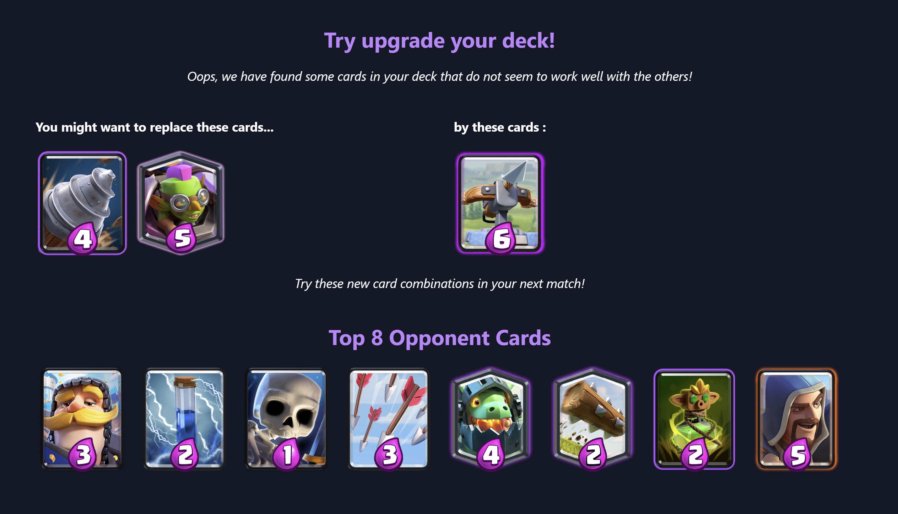

# Deck Analysis for Clash Royale - Master MIAGE Project

## Introduction

This project is part of the Master MIAGE program. It focuses on the analysis of decks in the popular game Clash Royale. The aim is to provide insights into the effectiveness of different card combinations and to suggest alternative decks or cards based on synergy and counter relationships.

## Features

- **Deck Analysis**: Analyze the effectiveness of a deck based on a set of norms. The performance of a deck is influenced by several factors, including the appropriate combination of card functions.
- **Synergy and Counter Information**: For each card, a list of cards that synergize well, are stronger (counters), and are weaker are compiled into a list of lists.
- **Game Parameter Visualization**: This tool helps users get an overview of the cards and the game's effectiveness over time.
- **Data Storage**: The storage of battle log data and data used to analyze the most used deck is done in parallel with the analyses. The retrieved data is stored in our MongoDB database for future use.

## Installation
### 1. Clone the project

Connect to your MongoDB Compass and create your own connection link if you want to see the saved data. You'll need to create a new database.

### 2. Go to the backend folder by typing `cd backend` in the terminal.

Create a `.env` file inside it, which may look like this :

```
PORT = 3000
API_KEY = 'Your_Key_Here'
MONGO_URI = 'link_to_your_MongoDB'
```


### 3. Go to the frontend folder by typing `cd frontend` in the terminal.

Create a `config.ts` file inside `src`, which may look like this:

```
const config = {
   API_KEY: 'Your_API_KEY_here' 
};
export default config;
```

### 4. Install dependencies using `npm install` or `npm i`

Don't forget to do it on both frontend and backend. You must have 2 terminals running at the same time

### 5. Use `npm run dev` for Frontend, and `npm start` for Backend

## Screenshots





